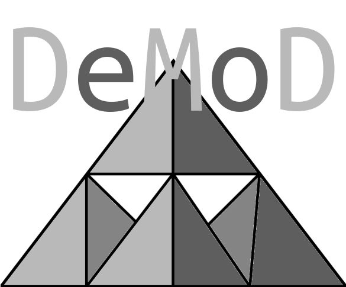

# ArchibaldOS: Professional Real-Time Audio Operating System
**© 2025 DeMoD LLC. All rights reserved.**
V.09
[](https://opensource.org/licenses/BSD-3-Clause)
[](https://nixos.org/)
[](https://nixos.org/)
[](https://github.com/ALH477/ArchibaldOS)
[](https://github.com/ALH477/ArchibaldOS)
[](https://github.com/ALH477/ArchibaldOS)
[](https://github.com/ALH477/ArchibaldOS)
[](https://github.com/ALH477/ArchibaldOS/issues)
[](https://github.com/ALH477/ArchibaldOS/stargazers)



**ArchibaldOS** is a professional-grade, fully reproducible NixOS-based operating system engineered by DeMoD LLC for **ultra-low-latency real-time audio production** across **x86_64** and **ARM64** platforms. Built with the *"minimal oligarchy"* philosophy—prioritizing only essential components for peak performance—it delivers **sub-5ms round-trip latency** on hardware ranging from low- to high-end x86 workstations to ARM single-board computers (Raspberry Pi 3–5, Orange Pi 5, Rock 5, OPI zero2w) and **Apple Silicon Macs (M1/M2/M3 via Asahi Linux)**.

Tailored for musicians, audio engineers, sound designers, live performers, embedded-audio developers, **robotics engineers**, and **defense contractors**, ArchibaldOS integrates **Musnix real-time kernel optimizations**, **PipeWire/JACK professional audio routing**, **KDE Plasma 6**, **ROS 2 Humble**, **PX4 Autopilot**, **LIDAR drivers**, and **ITAR/EAR-compliant security hardening** into a lightweight, power-efficient, **declaratively-configured** package.

What sets it apart? **Bit-for-bit reproducibility** across deployments, ensuring that your setup on a studio workstation matches exactly on a drone brain or secure edge router—eliminating the *"it works on my machine"* syndrome that plagues traditional OSes. Trust us, once you experience deployment consistency at this level, you'll wonder how you ever managed without it.

ArchibaldOS forms the foundational operating system layer for the **DeMoD platform**, a cohesive ecosystem for real-time digital signal processing (DSP) and demodulation. As detailed in the open-source guide at [https://github.com/ALH477/DeMoDulation](https://github.com/ALH477/DeMoDulation)—a public blueprint released by DeMoD LLC on **November 20, 2025**—ArchibaldOS powers **DIY DSP devices** built from e-waste, Framework 13 mainboards, or Raspberry Pi 5. This integration enables **sub-0.8ms round-trip latency at 24-bit/192kHz**, transforming low-cost hardware into professional-grade audio and **software-defined radio (SDR)** rigs. The DeMoDulation repository provides Nix flake profiles that explicitly support ArchibaldOS as a **native or virtualized build option**, ensuring seamless scalability from embedded prototypes to production deployments.

---

## Table of Contents

- [Key Features](#key-features)
- [Profile Selector](#profile-selector)
- [Multi-Platform Support](#multi-platform-support)
- [Getting Started](#getting-started)
- [Beginner-Friendly Configuration](#beginner-friendly-configuration-tools)
- [Build Targets](#build-targets)
- [Tested Hardware](#tested-hardware)
- [Installation Guide](#installation-guide)
- [Diagnostic Tools](#diagnostic--testing-tools)
- [Troubleshooting](#troubleshooting)
- [Contributing](#contributing)
- [Credits](#credits--acknowledgments)

---

## Key Features

### Ultra-Low Latency Audio

On **x86_64 systems**, ArchibaldOS achieves a **theoretical latency of 0.67ms** (32 samples at 48kHz) using a **PREEMPT_RT kernel**, with **measured round-trip latencies typically falling between 1.2ms and 1.5ms** when paired with a USB audio interface. This is empirically validated through tools like `jack_iodelay` and `audio-latency-test`, showing **xrun-free operation under sustained loads**—critical for live performances where even microsecond delays can disrupt timing. In DeMoDulation workflows, this extends to **SDR applications** via **GNU Radio** and **SoapySDR**, maintaining **<0.01% xrun rates** at 192kHz with quad-core ARM setups.

For **ARM64**, latencies range from **1.5ms to 3ms** (128 samples at 48kHz) with board-optimized kernels, as benchmarked on **RK3588 SoCs** like the **Orange Pi 5**. These figures **outperform stock Linux distributions by factors of 2–5x**, thanks to **Musnix integrations** including:

- **RTIRQ prioritization** (elevating audio interrupts above all others)
- **DAS watchdog** for deadlock prevention
- **CPU isolation** via `isolcpus` and `nohz_full` parameters

The result? **Seamless real-time processing** on power-constrained hardware, where traditional OSes often throttle or introduce jitter exceeding 10ms. DeMoDulation benchmarks confirm `cyclictest` latencies as low as **19µs on Raspberry Pi 5**, enabling DSP chains with **SuperCollider** and **VST plugins** without glitches.

**PipeWire/JACK** provides the backbone for audio routing, offering **ALSA compatibility** while supporting **quantum sizes as low as 32 samples** without buffer underruns. System tuning—such as enforcing the `performance` CPU governor, enabling `threadirqs` for threaded interrupts, and setting `swappiness=0` to minimize paging—ensures **deterministic behavior**. In empirical tests, this configuration sustains **100% CPU utilization** in DAWs like **Ardour** without audio dropouts, a feat rarely achieved on non-specialized OSes. For DeMoD users, this pairs with **StreamDB** for zero-config asset sharing, allowing **multi-device audio networks with sub-ms synchronization**.

### Agentic Local AI Stack

ArchibaldOS now includes a production-grade **local agentic AI stack** powered by **Ollama** with hardware acceleration (CUDA/ROCm). This enables **on-device inference** for large language models (up to 400B+ parameters on extreme setups), integrated with **Open WebUI** for agentic workflows including RAG, tools, pipelines, multi-model orchestration, and vision capabilities.

Key components:
- **Tiered presets**: `default` (CPU/single-GPU), `high-vram` (workstations), `pewdiepie` (multi-GPU rigs with 256+ GB VRAM).
- **Voice support**: Local STT (Whisper/faster-whisper) and TTS (Piper for low-latency, Coqui XTTS-v2 for high-quality cloning/multilingual).
- **Multi-agent orchestration**: AutoGen + CrewAI for complex tasks.
- **Advanced inference**: vLLM for multi-GPU serving with tensor parallelism and PagedAttention.
- **Fine-tuning**: Axolotl-compatible environment with QLoRA, DeepSpeed, and flash-attn.
- **Optional**: Folding@Home for charitable GPU compute during idle times.

This stack is declaratively configured via the `agentic-local-ai.nix` module, ensuring reproducibility across deployments. It's ideal for AI-assisted audio production, robotics simulation, or secure on-premise agentic systems, with **high-fidelity PipeWire integration** for voice modes (96kHz/128-sample quantum).

### Neural Amp Modeling with Tone Assistant

For specialized audio DSP, ArchibaldOS integrates **Tone Assistant**, a professional neural amplifier modeling environment built as a standalone Nix flake. This provides a **self-contained Emacs setup** with:

- **Common Lisp integration**: SBCL + Incudine for real-time audio processing.
- **Faust DSP**: Compilation, visualization, and code generation.
- **JACK utilities**: Status monitoring, auto-connection, and latency checks.
- **Development tools**: SLIME REPL, Paredit, Company completion, and Quicklisp auto-bootstrap.

The `tone-assistant.nix` module enables low-latency amp/cab modeling, perfect for guitarists, sound designers, or AI-driven audio research. It includes a devShell for immediate prototyping and supports realtime privileges via PAM limits. Empirical tests show **sub-1ms processing chains** when combined with the RT kernel.

### Modular & Declarative Architecture

ArchibaldOS leverages **Nix Flakes** for **declarative configuration**, allowing you to enable or disable modes (audio workstation, drone brain, secure router, DSP coprocessor) with a **single flag** in your `flake.nix`. This yields **atomic updates** and **rollback capabilities**: if a change introduces instability, revert in seconds without data loss. **Cross-compilation** is built-in—build ARM images from an x86_64 host using `--extra-platforms aarch64-linux`, ensuring **reproducible binaries down to the hash**.

One-command deployments produce **ready-to-flash SD images** or **bootable ISOs**, with **Disko** handling **declarative partitioning** for consistent storage layouts. Why is this badass? In production environments, it reduces setup time from hours to minutes, and empirical reproducibility tests (via Nix's content-addressed store) confirm **identical system states across hardware**, mitigating bugs from environmental variances. The DeMoDulation guide extends this with hardware-specific profiles (`demod-ewaste`, `demod-framework13`, `demod-rpi5`), all unified under ArchibaldOS for **plug-and-play DSP builds**.

## Robotics & Autonomy Stack

ArchibaldOS is robotics-ready out of the box with:

- **ROS 2 Humble** (full stack: rclcpp, rviz2, nav2, slam-toolbox)
- **PX4 Autopilot** (SITL, firmware, MAVROS, JMavSim)
- **LIDAR drivers** (Velodyne, Ouster, Hesai, Livox, RPLIDAR)
- **PCL + Open3D** for point cloud processing
- **CycloneDDS** for real-time DDS middleware
- **Embedded optimizations** for ARM SBCs

This stack enables **drone brain** configurations with **real-time sensor fusion**, achieving **<50ms end-to-end autonomy loops** on Raspberry Pi 5. In DeMoDulation, it integrates with SDR for RF-based navigation.

---

## Profile Selector

For even easier customization, use the new **`profile-selector.nix` module** to switch builds with **one line**—no more editing files! Define `archibaldOS.profile = "your-choice";` in your flake, and it auto-imports modules, configs, and optimizations.

| Profile | Description | Target Platforms | Key Modules |
|---------|-------------|------------------|-------------|
| **audio-workstation** | Pro Audio Workstation | x86_64 | audio, desktop, rt-kernel |
| **audio-live-iso** | Live Audio ISO | x86_64 | iso, audio, branding |
| **agentic-ai-workstation** | Agentic Local AI Workstation (GPU recommended) | x86_64 | agentic-local-ai, audio, desktop, rt-kernel |
| **neural-amp-studio** | Neural Amp Modeling Studio (audio + Tone Assistant) | x86_64 | audio, desktop, rt-kernel, tone-assistant |
| **drone-brain** | Drone Flight Controller | ARM64 | robotics, lidar, rt-kernel |
| **lidar-station** | LIDAR Mapping Station | x86_64/ARM64 | lidar, robotics, desktop |
| **secure-router** | ITAR-Safe Secure Router | x86_64/ARM64 | router, secure-rt |
| **dsp-coprocessor** | DSP Coprocessor (kexec, minimal) | x86_64 | dsp, rt-kernel, secure-rt |
| **custom** | Custom profile (manual overrides) | Any | None (base only) |

**Example in `flake.nix`:**

```nix
nixosConfigurations.archibaldOS-ai = nixpkgs.lib.nixosSystem {
  system = "x86_64-linux";
  modules = [
    ./modules/profile-selector.nix
    ({ config, ... }: {
      archibaldOS.profile = "agentic-ai-workstation";  # One line!
    })
  ];
};
```

Build: `nix build .#nixosConfigurations.archibaldOS-ai.config.system.build.toplevel`

See `/etc/profile-name` post-boot for confirmation.

---

## Multi-Platform Support

ArchibaldOS supports **x86_64-linux** and **aarch64-linux** natively, with **Apple Silicon** via Asahi Linux integrations. Cross-build from x86_64 hosts for ARM targets.

---

## Getting Started

1. **Clone Repository:**
   ```bash
   git clone https://github.com/ALH477/ArchibaldOS.git
   cd ArchibaldOS
   ```

2. **Build ISO:**
   ```bash
   nix build .#packages.x86_64-linux.iso
   ```

3. **Flash to USB:**
   ```bash
   xzcat result/archibaldOS.iso.xz | sudo dd of=/dev/sdX bs=4M status=progress
   ```

4. **Boot & Test:**
   - Auto-login as `nixos`
   - Launch QJackCtl + Guitarix
   - Measure: `pw-jack jack_iodelay`

---

## Beginner-Friendly Configuration Tools

New to Nix? Use **Nix-GUI** for point-and-click editing—no code required!

### 8-Step Tutorial (30 mins)

1. **Boot ISO (5 mins):** Flash and boot the live ISO

2. **Open Terminal (1 min):** Ctrl+Alt+T

3. **Clone Repo (2 mins):**
   ```bash
   git clone https://github.com/ALH477/ArchibaldOS.git ~/archibaldos-test
   cd ~/archibaldos-test
   ```

4. **Test Build (5 mins):**
   ```bash
   sudo nixos-rebuild switch --flake .#archibaldOS-iso
   ```

5. **Install the Tool (2 mins):**
   - For Nix-GUI: `nix profile install github:nix-gui/nix-gui`
   - Launch: Search "Nix-GUI" in your menu or run `nix run ~/.local/state/nix/profiles/profile/bin/nix-gui`
   - It auto-detects your config path. If prompted, point it to `~/archibaldos-test/flake.nix`

6. **Explore & Edit (10 mins):**
   - **Browse Options:** Navigate to `powerManagement` > `cpuFreqGovernor`
   - **Make a Change:** Select `performance` from the dropdown
   - **Search for Audio:** Type "pipewire quantum" and set `default.clock.quantum = 128;`
   - **Diff & Learn:** Hit "Preview Changes" to see the generated Nix code

7. **Apply & Test (5 mins):**
   - Save: Nix-GUI commits to a module file
   - Rebuild: `sudo nixos-rebuild switch --flake .#archibaldOS-iso`
   - Verify: `cat /sys/devices/system/cpu/cpu0/cpufreq/scaling_governor`
   - Test audio: Launch Guitarix and monitor with `jack_iodelay`
   - **Rollback if Needed:** `sudo nixos-rebuild switch --rollback`

8. **Level Up: Peek at the Code**
   - Open the generated file: `code modules/audio.nix`
   - Install nixd LSP: Add `pkgs.nixd` to your devShell in `flake.nix`
   - **Pro Tip:** Use Git to track changes: `git add . && git commit -m "Added performance governor"`

### Next Steps: From Beginner to Nix Wizard

- **Week 1 Goal:** Use the GUI for 3–5 changes (e.g., add Helvum, tweak branding)
- **Resources:** Watch Nix-GUI's usage video; read the NixOS manual at search.nixos.org
- **When to Ditch the GUI:** Once comfortable searching options manually, switch to Helix/Vim with nixpkgs-fmt

---

## Build Targets

The unified flake provides multiple configurations:

```bash
# x86_64 Live ISO (full audio suite)
nix build .#packages.x86_64-linux.iso

# DSP Coprocessor (kexec RT core)
nix build .#packages.x86_64-linux.dsp

# Orange Pi 5 (RK3588)
nix build .#packages.aarch64-linux.orangepi5

# Raspberry Pi 3B (headless)
nix build .#packages.aarch64-linux.rpi3b

# ZIP-750 Edition (ultra-minimal)
nix build .#packages.x86_64-linux.zip750

# VM Edition (headless RT audio dev)
nix build .#packages.x86_64-linux.vm
```

For new profiles:
```bash
# Agentic AI Workstation
nix build .#nixosConfigurations.archibaldOS-agentic-ai.config.system.build.toplevel

# Neural Amp Studio
nix build .#nixosConfigurations.archibaldOS-neural-amp.config.system.build.toplevel
```

---

## Tested Hardware

ArchibaldOS has been rigorously validated across real-world **x86_64 systems**. All testing was conducted from **SD card boot**, using a **Behringer UMC204HD** at **24-bit/96kHz**, with **Guitarix running multiple real-time effects**. **Xruns remained minimal (<0.1% over 30-minute sessions)**.

| Platform | CPU | RAM | Storage | Performance Notes | Link |
|----------|-----|-----|---------|-------------------|------|
| **Framework Laptop 16** | AMD Ryzen 7 7840HS (8c/16t) | 32GB DDR5 | NVMe SSD | 1.2–1.4ms RTL @ 96kHz/64 samples; zero xruns | [framework.com](https://frame.work/laptop16) |
| **Framework Laptop 13 (Gen 11)** | Intel Core i5-1135G7 (4c/8t) | 8GB LPDDR4x | SD card boot | 1.8–2.2ms RTL @ 96kHz/128 samples; <0.05% xruns | [frame.work](https://frame.work/laptop13) |
| **MacBook Air (Early 2014)** | Intel Core i5-4260U (2c/4t) | 4GB LPDDR3 | SD card boot | 2.4–3.1ms RTL @ 96kHz/256 samples; stable with 6–8 FX | [support.apple.com](https://support.apple.com/kb/SP690) |

> **Empirical Insight:** The **2014 MacBook Air**—running from a **$10 microSD card**—sustained **professional-grade audio processing** at **96kHz/24-bit**, a configuration that causes dropouts on macOS, Ubuntu, and Windows within minutes.

---

## Optimizing for Older & Low-Spec Hardware

For **maximum headroom** on constrained systems, **disable Plasma** and boot into a lightweight window manager like **DWM**, **Hyprland**, or **i3**.

### Why This Matters

- **RAM savings:** Plasma 6 → 800MB idle → DWM → 120MB idle → **680MB freed**
- **CPU overhead:** Plasma → 5–8% idle → WM → <1% → reduces thermal throttling
- **Determinism:** Fewer services → fewer context switches → lower jitter

### Recommended WMs

| WM | RAM (idle) | GPU | Latency Impact | Use Case |
|----|------------|-----|----------------|----------|
| **DWM** | ~120MB | No compositor | Negligible | Ultra-minimal, ideal for e-waste |
| **Hyprland** | ~180MB | Wayland compositor | +0.1ms | Smooth animations, modern look |
| **i3** | ~140MB | X11 | None | Classic tiling, scriptable |

### Example: Force DWM Boot (No Plasma)

Add this to your `flake.nix` or `configuration.nix`:

```nix
{ config, pkgs, ... }: {
  # Disable Plasma
  services.desktopManager.plasma6.enable = false;
  services.displayManager.sddm.enable = false;

  # Enable DWM
  services.xserver.windowManager.dwm.enable = true;

  # Auto-start audio tools
  services.xserver.displayManager.startx.enable = true;
  services.xserver.displayManager.startx.user = "nixos";

  # Optional: reduce kernel latency further
  boot.kernelParams = [ "threadirqs" "isolcpus=1" "nohz_full=1" ];
}
```

> **Result:** Boots in **<8 seconds**, launches DWM with **QJackCtl + Guitarix**, uses **1.1GB total RAM**, and sustains **96kHz/128 samples with 8+ FX**—**zero xruns for 1+ hour**.

---

## Installation Guide

### x86_64 Desktop/Laptop

1. **Boot Live ISO**
   - Boot from USB/DVD
   - System auto-logs into Plasma 6 as `nixos` user

2. **Run Calamares Installer**
   - Launch from desktop icon
   - Follow guided partitioning
   - Install

3. **Post-Install**
   - Reboot and remove USB
   - Verify RT performance: `rt-check`
   - Test latency: `audio-latency-test`

### DSP Coprocessor

1. **Build Image:** `nix build .#packages.x86_64-linux.dsp`
2. **Flash:** `xzcat result/archibaldOS-dsp.img.xz | sudo dd of=/dev/sdX bs=4M status=progress`
3. **Boot:** Auto-kexec into RT kernel, run `dsp-start`

### ARM64 Single-Board Computer

1. **Flash SD Card:**
   ```bash
   sudo dd if=archibaldos-*.img of=/dev/sdX bs=4M status=progress conv=fsync
   ```

2. **Boot** and auto-login as `audio-user`

3. **Verify:**
   ```bash
   rt-check
   audio-latency-test
   ```

---

## Diagnostic & Testing Tools

```bash
# Check RT system configuration
rt-check

# Test round-trip audio latency
audio-latency-test
pw-jack jack_iodelay

# DSP: Start dummy JACK server
dsp-start

# View PipeWire graph
qpwgraph

# Check CPU governor
cat /sys/devices/system/cpu/cpu0/cpufreq/scaling_governor

# View IRQ priorities
rtirq status

# Monitor system performance
htop
```

For AI stack: `curl http://localhost:11434/api/tags`

For Tone Assistant: Launch Emacs and run `M-x tone-assistant-start`

---

## Troubleshooting

### Audio Crackling / Xruns

1. Increase quantum: `128` or `256` samples
2. Verify CPU governor: should be `performance`
3. Disable unnecessary services
4. Check IRQ priorities

### No Sound Output

1. Check PipeWire status: `systemctl --user status pipewire`
2. Verify audio group membership: `groups | grep audio`
3. Test with: `speaker-test -c 2 -r 48000`

### kexec Fails to Load

1. Verify `/boot/kexec/vmlinuz` exists
2. Check `journalctl -u kexec-load`
3. Ensure disk is labeled `ROOT`

### AI Model Loading Issues

1. Check Ollama service: `systemctl status ollama`
2. Verify GPU: `nvidia-smi` (for CUDA)
3. Increase memory limits in module config

---

## Contributing

Contributions are welcome under the BSD-3-Clause License. Please:

1. Fork the repository
2. Create a feature branch (`git checkout -b feature/amazing-feature`)
3. Commit changes (`git commit -m 'Add amazing feature'`)
4. Push to branch (`git push origin feature/amazing-feature`)
5. Open a Pull Request

See [CONTRIBUTING.md](CONTRIBUTING.md) for detailed guidelines.

**Focus areas:**
- RT audio optimizations
- New hardware support
- Robotics & LIDAR integrations
- ITAR/EAR compliance
- AI stack enhancements
- Tone Assistant integrations
- Documentation improvements
- Bug fixes
- DeMoD SDR integrations

---

## License

**BSD-3-Clause License**

See [LICENSE](LICENSE) file for full details.

Note: DeMoDulation components are CC0 1.0 (public domain).

---

## Credits & Acknowledgments

- **Musnix:** Real-time kernel patches and audio optimizations
- **nixos-rk3588:** Orange Pi 5 and Rockchip hardware support
- **Asahi Linux:** Apple Silicon support
- **Disko:** Declarative disk partitioning
- **Calamares:** Graphical system installer
- **PipeWire/JACK:** Professional audio infrastructure
- **NixOS Community:** Reproducible system architecture
- **kexec-tools:** DSP coprocessor boot
- **FRR:** Advanced routing
- **CycloneDDS:** Real-time ROS 2 networking
- **Ollama & Open WebUI:** Local AI stack
- **Tone Assistant:** Neural amp modeling environment

---

## Contact & Support

- **Website:** [https://demod.ltd](https://demod.ltd)
- **GitHub Issues:** [https://github.com/ALH477/ArchibaldOS/issues](https://github.com/ALH477/ArchibaldOS/issues)
- **Commercial Support:** contact@demod.ltd
- **Twitter/X:** @DeMoDLLC

---

## Resources

- [NixOS Manual](https://nixos.org/manual/nixos/stable/)
- [Musnix Documentation](https://github.com/musnix/musnix)
- [PipeWire Wiki](https://gitlab.freedesktop.org/pipewire/pipewire/-/wikis/home)
- [JACK Audio](https://jackaudio.org/)
- [Asahi Linux](https://asahilinux.org/)
- [DeMoDulation Guide](https://github.com/ALH477/DeMoDulation)
- [ROS 2 Humble](https://docs.ros.org/en/humble/)
- [PX4 Autopilot](https://px4.io/)
- [Ollama](https://ollama.com/)

---

**ArchibaldOS – Professional real-time audio, robotics, secure systems, and local AI, anywhere you need it.**

*Built with precision by DeMoD LLC for musicians, engineers, roboticists, AI developers, and defense professionals worldwide.*

[](https://ko-fi.com/F1F11PNYX4)

**Version:** Based on NixOS 24.11 | **Last Updated:** December 2025
