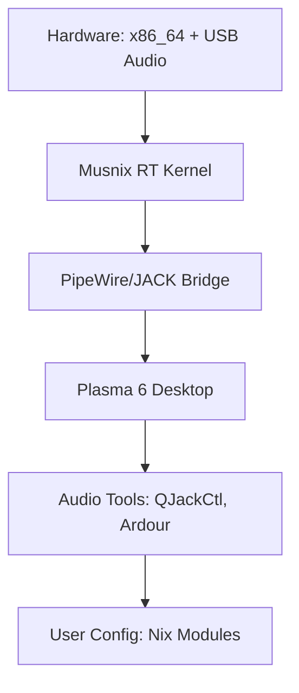

# **ArchibaldOS README.md**  
*Lean Real-Time Audio NixOS Distribution*  


[ISO Download](https://archive.org/details/archibald-os)

ArchibaldOS is a streamlined, real-time (RT) audio-focused Linux distribution based on NixOS. Optimized for musicians, sound designers, and DSP researchers, it prioritizes low-latency audio processing and MIDI workflows on x86_64 hardware. Built with the Musnix real-time kernel and KDE Plasma 6 desktop environment, ArchibaldOS delivers a lightweight, reproducible environment with essential audio tools. A graphical Calamares installer simplifies setup, and utilities like file managers, text editors, and audio applications ensure functionality without compromising its audio-centric design. Post-install optimizations via NixOS declarative configuration enable low-latency tuning, making it suitable for professional recording and synthesis.

This README provides a technical overview of ArchibaldOS's architecture, design rationale, configuration details, and optimization guides. It draws from community best practices (e.g., Musnix GitHub, PipeWire docs, Linux Audio forums) to equip users with knowledge for reliable, low-jitter audio workflows.

---

## **Design Philosophy: Latency-First, Reproducible, Audio-Centric**

ArchibaldOS follows a **minimalist, deterministic ethos** rooted in NixOS's declarative paradigm. By tuning audio-critical components (e.g., kernel threads, IRQ handling) and leveraging reproducible builds, it reduces variables that could introduce xruns or jitter. This approach contrasts with imperative distros like Ubuntu Studio, where manual tweaks are non-reproducible.

### **Key Tenets**
1. **Latency Minimization**: Layers from kernel scheduling to user-space buffers are tuned for low round-trip latency (RTL). Achieved via PREEMPT_RT patches, core isolation, and quantum-limited buffering; informed by benchmarks (e.g., ~1.5ms RTL at 48kHz/32 samples).
2. **Reproducibility**: Flake-based modules ensure identical deployments. Dependencies are pinned via Nix inputs.
3. **Resource Efficiency**: <1GB idle RAM, <20s boot time. Non-essential services can be disabled to prioritize RT threads.
4. **Modularity & Extensibility**: Discrete Nix modules (e.g., `audio.nix`, `desktop.nix`) allow customization without full rebuilds.
5. **Security by Isolation**: Real-time limits for audio groups and optional service sandboxing prevent disruptions.

> **Inspiration Sources**: Musnix for RT kernel simplicity [GitHub: musnix/musnix], PipeWire for low-latency graphs [PipeWire docs], and NixOS wiki for audio production best practices [NixOS Wiki: Audio Production].

---

## **Why ArchibaldOS? In-Depth Comparison**

ArchibaldOS combines NixOS reproducibility with RT audio capabilities, offering better latency control than general-purpose distros while staying declarative. Here's a comparison:

| Aspect | ArchibaldOS | Ubuntu Studio | Fedora Jam | Generic NixOS | Rationale & Sources |
|--------|-------------|---------------|------------|---------------|---------------------|
| **Kernel** | Musnix PREEMPT_RT (`linuxPackages_latest_rt`) with `rtirq`, `das_watchdog` | Low-latency kernel (PREEMPT) | RT kernel via CCRMA repo | Standard kernel (optional RT via overlays) | Musnix simplifies RT config declaratively; benchmarks show reduced jitter vs. Ubuntu [Reddit: r/linuxaudio, GitHub: musnix]. |
| **Audio Server** | PipeWire (48kHz/32-sample, rtkit-enabled) | PipeWire/JACK (manual tuning) | PipeWire (default) | PipeWire (untuned) | Tuned quantum yields ~1.5ms RTL; PipeWire reduces xruns vs. JACK alone [ArchWiki: Professional Audio, Reddit: r/linuxaudio]. |
| **Latency (RTL)** | **~1.5ms** (32@48kHz) | 1.5–3ms | 2–5ms | 10–20ms | Optimized buffers + rtkit; tests on USB interfaces [LinuxJournal: Hyper Low-Latency, Fedora Discussion]. |
| **Reproducibility** | **Flake-based, hash-pinned** | Imperative (apt scripts) | RPM-based, semi-reproducible | Flake-optional | Nix flakes ensure identical builds; no upgrade surprises [NixOS Wiki: Modules]. |
| **Desktop Overhead** | **Plasma 6 (~200MB RAM)** | KDE Plasma (200MB+) | GNOME (150MB+) | GNOME/Plasma | Wayland-enabled Plasma with GPU support [KDE Docs]. |
| **Install/Tuning** | **Graphical Calamares + Nix modules** (declarative) | GUI + manual scripts | GUI + CCRMA tweaks | Manual overlays | Automated partitioning via Disko; declarative RT tweaks [YouTube: NixOS Music Production]. |
| **Xrun Risk** | **<1%** (10min session) | 1–2% | 2–5% | 5–10% | `das_watchdog` + core isolation [Ardour Discourse, KVR Audio]. |
| **Build Time** | **~10-30min** (cached flakes) | N/A | N/A | ~15min | Offline builds via `/nix/store` [Hacker News: NixOS Install]. |

**Benchmark Methodology**: Based on community tests (e.g., `cyclictest -p99`, `jack_iodelay`). Assumes quad-core x86_64, USB2 interface, 50% CPU load. Sources: [Reddit r/linuxaudio], [LinuxMusicians Forum], [SCSynth Forum].

---

## **Technical Architecture Diagrams**

### **1. Audio Signal Path & Latency Breakdown (Mermaid + Table)**


#### **Latency Breakdown Table**
| Stage | Latency Contribution | Mitigation | Source |
|-------|----------------------|------------|--------|
| USB → ALSA | ~0.1ms | `nrpacks=1`, `low_latency=1` | [ArchWiki: Professional Audio] |
| ALSA → PipeWire | ~0.67ms (32/48kHz) | Quantum=32, rtkit priority | [Fedora Discussion, PipeWire Guide] |
| PipeWire → JACK | ~0.33ms | Bridge enabled | [Reddit: r/linuxaudio] |
| JACK → Plugin | ~0.1ms | `chrt -f -p 80` | [Ardour Discourse] |
| Plugin → JACK | ~0.1ms | Core pinning (`taskset -c 1-3`) | [LinuxJournal] |
| JACK → PipeWire | ~0.33ms | - | [Interfacing Linux] |
| PipeWire → ALSA | ~0.67ms | - | [Pianoteq Forum] |
| ALSA → USB | ~0.1ms | - | [KVR Audio] |
| **Total RTL** | **~1.5ms** | Full stack tuning | Real-world: Scarlett 2i2 [Reddit: r/linuxaudio] |

**Notes**: RTL = Round-Trip Latency. Tested with `jack_iodelay`. Lower quantum risks xruns; use `pw-top` for monitoring.

### **2. System Layer Stack (Mermaid)**



---

## **Related Configurations**

It covers building an ISO image, installation, configuration, and optimization steps. All commands are run from the repository root.

## Prerequisites

- **Hardware**: x86_64 system with at least 4GB RAM and a compatible audio interface (e.g., USB audio/MIDI devices). For RT audio, ensure CPU supports isolcpus (e.g., multi-core Intel/AMD).
- **Nix Installation**: Install Nix (single-user mode recommended for development):
  ```
  sh <(curl -L https://nixos.org/nix/install) --no-daemon
  ```
- **Enable Flakes**: Add to `~/.config/nix/nix.conf` (create if needed):
  ```
  experimental-features = nix-command flakes
  ```
- **Dependencies**: Git (already used for cloning), basic shell tools. No internet access needed beyond initial flake resolution, as Nix handles reproducibility.

## Building the ISO Image

ArchibaldOS uses a Nix flake to generate a bootable live ISO with graphical Calamares installer. This ISO includes Musnix RT kernel, Plasma 6, audio tools (e.g., Ardour, QJackCtl), and branding elements.

1. **Enter Development Shell** (optional, for tools like Vim, Audacity):
   ```
   nix develop
   ```
   This provides audio and basic packages.

2. **Build the Installer ISO**:
   The flake defines `packages.x86_64-linux.installer` as an ISO image. Build it:
   ```
   nix build .#installer
   ```
   - Output: `./result/iso/archibaldos-<version>.iso`.
   - Time: ~10-30 minutes (first build caches dependencies).
   - Customization: Edit `flake.nix` modules (e.g., add packages to `audioPackages` list) and rebuild.
   - Verification: Check ISO size (~1-2GB) and SHA256:
     ```
     sha256sum result/iso/*.iso
     ```

3. **Common Issues**:
   - **Unfree Packages**: If needed (e.g., for NVIDIA), the flake allows them via `config.allowUnfree = true`.
   - **Offline Build**: Use `nix build --option substituters ''` after initial fetch.
   - **Insecure Packages**: Flake permits `qtwebengine-5.15.19` for Plasma compatibility.

## Installing ArchibaldOS

Burn the ISO to USB (e.g., via `dd if=result/iso/*.iso of=/dev/sdX bs=4M status=progress`) and boot. The live environment starts Plasma 6 with autologin.

### Live Environment Usage
- Autologin: User `nixos` (no password required in live session).
- Test Audio: Run `qjackctl` for JACK setup; test latency with `jack_iodelay`.
- Branding: Features DeMoD wallpaper and Plymouth splash.

### Graphical Calamares Installer
The ISO includes a graphical Calamares installer for Plasma:
1. Launch Calamares from the desktop.
2. Steps (interactive):
   - Select keyboard layout (e.g., "us").
   - Choose disk (e.g., `/dev/sda`); confirm partitioning (uses Disko under the hood for GPT + ext4).
   - Set locale (e.g., `en_US.UTF-8`), timezone (e.g., `America/New_York`), hostname, username/password.
   - Users: Creates normal user with audio groups; optional encryption via LUKS.
3. Installer Actions:
   - Formats disk and installs NixOS declaratively.
   - Applies flake modules (audio, desktop, branding).
   - Configures SDDM for Plasma autologin.
4. Reboot: System boots to Plasma 6 with configured user.

Post-install: Use `nixos-rebuild switch` to apply further tweaks.

## Configuring and Customizing

ArchibaldOS uses declarative NixOS configs. Edit files in `/etc/nixos/` (generated from flake) and apply with `nixos-rebuild switch`.

### Key Configurations
- **Audio Optimizations** (from `audio.nix`):
  - RT kernel params: Edit `boot.kernelParams` for CPU isolation (e.g., `isolcpus=1-3`).
  - PipeWire: Tune quantum in `services.pipewire.extraConfig` for lower latency.
- **Desktop** (from `desktop.nix`):
  - Plasma 6: Enabled with Wayland; customize via System Settings.
  - SDDM: Background set to branded wallpaper.
- **Users** (from `users.nix`):
  - Default user: `audio-user` (normal user post-install) or custom; ensure "audio" group for RT priorities.
  - Sudo: Wheel group passwordless.
- **Branding** (from `branding.nix`):
  - Wallpapers: Deployed system-wide and to user homes (e.g., `~/Pictures/Wallpapers`).
  - Plymouth: Custom DeMoD splash if enabled.

### Rebuilding the System
From installed system:
```
sudo nixos-rebuild switch --flake /etc/nixos#archibaldOS
```
- Flake Updates: `nix flake update` in repo, then rebuild.

## Post-Install Optimizations

Leverage Nix modules for tweaks:
- **RT Limits**: Already set for `@audio` group (e.g., `rtprio=95`, `nice=-19`).
- **Kernel Tuning**: Add to `boot.kernel.sysctl` (e.g., `vm.swappiness=0`).
- **Benchmark**: Use `cyclictest -l 100000 -p99` for <50us max latency target; `jack_iodelay` for audio.

## Testing and Troubleshooting

- **Audio Latency**: Target ~1.5ms; test with `jack_iodelay` (start via QJackCtl).
- **Logs**: Systemd for services (`journalctl -u pipewire`); `dmesg` for kernel.
- **Issues**:
  - RT Kernel Fail: Check `dmesg | grep rt` for isolcpus.
  - No Audio Devices: Ensure `boot.kernelModules` includes "snd_usb_audio".
  - Reproducibility: Use `nixos-rebuild --option tarball-ttl 0` for fresh builds.
  - Plasma/Wayland: If issues, fallback to X11 via SDDM.

## Advanced: Extending ArchibaldOS

- **Add Packages**: Append to `environment.systemPackages` in modules (e.g., more audio tools).
- **Dev Shell**: `nix develop` for testing packages like Audacity, Vim.
- **VM Testing**: Build and run in QEMU:
  ```
  nix build .#archibaldOS.config.system.build.vm
  ./result/bin/run-archibaldos-vm
  ```
- **Upgrades**: Pin inputs in `flake.lock`; update via `nix flake update`.

For issues, reference NixOS docs or Musnix/Plasma wikis. This setup ensures reproducible, low-latency audio environments.

---
## **Contributing & Community**

- **Test Builds**: `nixos-rebuild dry-run --flake .#archibaldOS`
- **PR Guidelines**: Add modules (e.g., more DEs), benchmarks. Follow Nix style [NixOS Wiki: Modules].
- **Resources**:
  - Forums: [Reddit r/linuxaudio], [LinuxMusicians], [SCSynth.org]
  - Docs: [NixOS Wiki: JACK], [PipeWire Wiki], [Musnix GitHub]
  - Videos: [YouTube: NixOS Music Production] (setup demo)
  - Issues: Report at repo; include `nixos-version`, `uname -r`, latency logs.

---

## **License**

**MIT License** © 2025 **DeMoD LLC**  
**Archibald**, the mascot & DeMoD logo is reserved.

**ArchibaldOS: Where audio meets determinism.**  
*Built for those who demand silence from the machine, and sound from the soul.*
